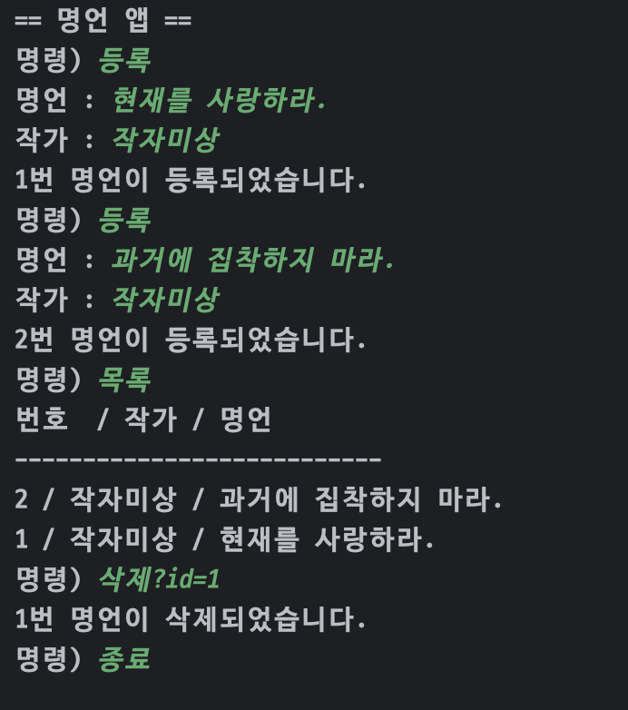

# 명령 게시판

## 목차
1. [출력 및 코드 설명](#출력-및-코드-설명)
    - [레벨 1](#레벨-1)
    - [레벨 2](#레벨-2)
    - [레벨 3, 4](#레벨-3-4)
    - [레벨 5](#레벨-5)
    - [레벨 6](#레벨-6)
    - [레벨 7](#레벨-7)
    - [레벨 8](#레벨-8)
    - [레벨 9](#레벨-9)
    - [레벨 10](#레벨-10)

---

## 출력 및 코드 설명

### 레벨 1
#### 출력 결과

#### 코드 설명
- **종료 기능**:  
  `while` 문에서 명령어로 `"종료"`가 입력되면 `break`를 통해 프로그램을 종료합니다.

---

### 레벨 2
#### 출력 결과

#### 코드 설명
- **등록 기능**:
    - 명령어로 `"등록"`이 입력되면 사용자로부터 **명언**과 **작가**에 대한 입력을 받습니다.

---

### 레벨 3, 4
#### 출력 결과

#### 코드 설명
- **등록 횟수 관리**:
    - `count` 변수를 활용해 **명언 번호**를 등록 횟수에 따라 증가시킵니다.

---

### 레벨 5
#### 출력 결과

#### 코드 설명
- **Switch 활용**:
    - 명령어를 추가할 때의 편의성을 위해 `switch` 문으로 변경했습니다.
- **클래스 설계**:
    - `noSpring.Quote` 클래스를 `public class`로 선언.
    - **Getter**와 **Constructor**를 추가했습니다.
- **리스트 관리**:
    - `List<noSpring.Quote> quotes`를 선언해 명언 객체를 저장합니다.
- **등록 및 출력 기능**:
    - `"등록"` 명령어: 입력받은 데이터를 `quotes` 리스트에 추가.
    - `"목록"` 명령어: 예제에 맞게 명언을 출력.

---

### 레벨 6
#### 출력 결과

#### 코드 설명
- **삭제 명령어 추가**:
    - `switch`에서 명령어를 처리할 때 입력을 `'?'` 기준으로 나눕니다.
    - `"삭제"` 명령어 입력 시 조건에 맞는 데이터를 삭제합니다.

---

### 레벨 7
#### 출력 결과

#### 코드 설명
- **예외 처리**:
    - **`flag`** 변수를 사용해 예외 상황을 처리합니다.

---

### 레벨 8
#### 출력 결과

#### 코드 설명
- **데이터 수정 기능**:
    - `newQuote`와 `newAuthor`를 통해 새로운 데이터를 입력받습니다.
    - `noSpring.Quote` 클래스에 **Setter**를 추가해 데이터를 수정 가능하도록 합니다.
    - 수정 불가능한 `id`는 **`final`**로 선언.
- **코드 흐름**:
    - 전반적인 로직은 `"삭제"` 기능과 유사하게 작성되었습니다.

### 레벨 9
#### 출력 결과

- **종료 후** 

#### 코드 설명
- **주요 변경점**:
    - 데이터 저장 방식 : 메모리 -> 파일
    - 프로그램이 종료되어도 영속성을 부여
    - Jackson 라이브러리를 통해 JSON 활용

### 레벨 10
#### 출력 결과

#### 코드 설명
- "빌드" 명령어를 추가하였다. 